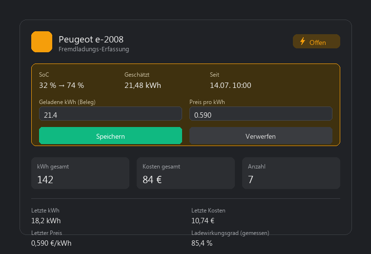

# EV Assistant Card

[](https://hacs.xyz)
[](https://github.com/weskona/ev-assistant-card/releases)

Lovelace card for the [EV Assistant](https://github.com/weskona/ev_assistant) integration. Shows detected external ("Fremdladung") charges and lets you confirm the real kWh/price **directly in the card** — no separate helper entities or automations needed.

**[🇩🇪 Deutsche Version weiter unten](#-deutsch)**



---

## 🇬🇧 English

### Features

- **Automatic entity discovery** via `device_id` — pick your vehicle once, the card finds all its sensors itself.
- **Two modes:** Compact (tile) and detail — toggle by clicking the card.
- **Inline confirmation form:** when a Fremdladung is pending, the detail view shows an editable kWh/price form with Save/Discard buttons that call the integration's services directly (`config_entry_id` is resolved automatically from the card's device — works correctly even if you run more than one EV Assistant instance). **More than one charge can be pending at once** (e.g. two charging stops before you get around to confirming either) — the card shows a separate form for each and confirms/discards the correct one.
- **Correct a past charge:** the detail view has a collapsible "History" list of your last 10 confirmed charges (date, kWh, price, cost). Each row has an edit button to fix a typo in kWh or price after the fact — the integration adjusts the running totals by the difference, no need to touch Developer Tools.
- **Delete a past charge:** each history row also has a delete button (with an inline "really delete?" confirmation) for removing a falsely detected charge entirely — e.g. it wasn't actually an external charge. Not reversible.
- **Charging duration** shown for pending charges and in the history list (e.g. "45 min" or "1h 15min"), where available.
- **Fahrtenbuch (trip log):** when a trip is detected (requires EV Assistant v0.14.0+ with an odometer entity configured), the detail view shows an inline start/end-location form next to the charge form, calling `ev_assistant.log_trip`/`discard_pending_trip` directly. A separate collapsible history lists the last 10 confirmed trips (date, km, route), each with edit (`edit_trip`) and delete (`delete_trip`) buttons — same "detect automatically, confirm manually" pattern as charges. Hidden entirely if the Fahrtenbuch feature isn't set up on the underlying integration.
- **Responsive layout** that adapts to the actual rendered card width (container queries), not just the browser window.
- Shows totals (kWh, cost, count), the last confirmed charge, and the measured charge-efficiency calibration status if available.

### Installation

**Via HACS**
1. HACS → Frontend → ⋮ → **Custom repositories**
2. URL: `https://github.com/weskona/ev-assistant-card` — Category: **Lovelace**
3. Install EV Assistant Card, reload the page

**Manual**
Copy `ev-assistant-card.js` to `/config/www/` and register it as a resource:
```yaml
lovelace:
  resources:
    - url: /local/ev-assistant-card.js
      type: module
```

### Configuration

```yaml
type: custom:ev-assistant-card
device_id: abc123def456   # the EV Assistant device (vehicle) this card belongs to
mode: compact              # compact (default) or detail
name: My Car               # optional, overrides the device name
```

Add the card via the dashboard UI's card picker ("EV Assistant Card") to get a device dropdown instead of typing the ID by hand.

| Option | Type | Default | Description |
|---|---|---|---|
| `device_id` | string | – | The EV Assistant device (vehicle) to show. Required unless `entity` is given. |
| `entity` | string | – | Alternative to `device_id`: any entity belonging to the vehicle's device — its device is used. |
| `name` | string | device name | Display name override. |
| `mode` | string | `compact` | Start mode: `compact` or `detail`. |

### How entity discovery works

The card never needs a manual list of entity IDs. For each entity belonging to the configured device, it checks (in this order):

1. **`unique_id` suffix** — stable, sensor-key-based, never changes regardless of renames (e.g. ends with `_total_kwh`).
2. **`translation_key`** — the integration's internal sensor identifier.
3. **Entity-ID substring** — a fallback covering both the current naming (`fremdladung_kwh_gesamt`) and the pre-v0.4.1 EV Assistant naming (`kwh_gesamt`), so the card works on older installations too.

### Why this replaces `packages/ev_assistant_ui.yaml`

The EV Assistant integration repo ships an optional YAML package with `input_number`/`input_text` helpers and automations that call the confirm/discard services. That approach needs the helpers to be copied into `config/packages/`, only ever tracks one vehicle's pending charge at a time (shared helper state), and its example Lovelace card hardcodes entity IDs that depend on your vehicle's device name.

This card needs none of that: point it at a device, and the form, the service calls (with the correct `config_entry_id` for that specific vehicle), and the entity lookup all happen inside the card itself. If you use the YAML package today, you can safely remove it once you switch to this card — one card per vehicle if you track more than one.

### Requirements

- [EV Assistant integration](https://github.com/weskona/ev_assistant) — any version (works with pre-v0.4.1 entity naming too, see "How entity discovery works")
- Home Assistant 2024.1+

---

## 🇩🇪 Deutsch

### Features

- **Automatische Entity-Erkennung** per `device_id` — Fahrzeug einmal auswählen, die Karte findet alle zugehörigen Sensoren selbst.
- **Zwei Modi:** Kompakt (Kachel) und Detail — per Klick umschaltbar.
- **Direktes Erfassungsformular:** ist eine Fremdladung offen, zeigt die Detailansicht ein bearbeitbares kWh/Preis-Formular mit Speichern/Verwerfen-Buttons, die die Services der Integration direkt aufrufen (`config_entry_id` wird automatisch aus dem Geräte-Bezug der Karte ermittelt — funktioniert auch korrekt bei mehreren EV-Assistant-Instanzen). **Es können mehrere Ladungen gleichzeitig offen sein** (z.B. zwei Ladestopps, bevor du zum Bestätigen kommst) — die Karte zeigt dann ein eigenes Formular je Ladung und bestätigt/verwirft die richtige.
- **Eine vergangene Ladung korrigieren:** die Detailansicht hat eine ausklappbare „Historie"-Liste der letzten 10 bestätigten Ladungen (Datum, kWh, Preis, Kosten). Jede Zeile hat einen Bearbeiten-Button, um einen Tippfehler bei kWh oder Preis nachträglich zu korrigieren — die Integration passt die laufenden Summen um die Differenz an, ganz ohne Entwicklerwerkzeuge.
- **Eine vergangene Ladung löschen:** jede Historien-Zeile hat auch einen Löschen-Button (mit Inline-Bestätigung „wirklich löschen?"), um eine fälschlich erkannte Ladung komplett zu entfernen — z.B. wenn es gar keine Fremdladung war. Nicht rückgängig zu machen.
- **Ladezeit** wird bei offenen Ladungen und in der Historie-Liste angezeigt (z.B. „45 min" oder „1h 15min"), sofern vorhanden.
- **Fahrtenbuch:** ist eine Fahrt erkannt (setzt EV Assistant v0.14.0+ mit konfigurierter Kilometerstand-Entität voraus), zeigt die Detailansicht neben dem Ladungs-Formular ein eigenes Start-/Zielort-Formular, das direkt `ev_assistant.log_trip`/`discard_pending_trip` aufruft. Eine eigene ausklappbare Historie listet die letzten 10 bestätigten Fahrten (Datum, km, Strecke), je mit Bearbeiten- (`edit_trip`) und Löschen-Button (`delete_trip`) — dasselbe Muster wie bei Fremdladungen. Bleibt komplett ausgeblendet, wenn das Fahrtenbuch-Feature in der zugrunde liegenden Integration nicht eingerichtet ist.
- **Responsives Layout**, das sich an die tatsächliche Kartenbreite anpasst (Container Queries), nicht nur an die Fenstergröße.
- Zeigt Summen (kWh, Kosten, Anzahl), die letzte bestätigte Ladung sowie den Status der Ladewirkungsgrad-Kalibrierung, falls vorhanden.

### Installation

**Über HACS**
1. HACS → Frontend → ⋮ → **Benutzerdefinierte Repositories**
2. URL: `https://github.com/weskona/ev-assistant-card` — Kategorie: **Lovelace**
3. EV Assistant Card installieren, Seite neu laden

**Manuell**
`ev-assistant-card.js` nach `/config/www/` kopieren und als Ressource registrieren:
```yaml
lovelace:
  resources:
    - url: /local/ev-assistant-card.js
      type: module
```

### Konfiguration

```yaml
type: custom:ev-assistant-card
device_id: abc123def456   # das EV-Assistant-Gerät (Fahrzeug), zu dem diese Karte gehört
mode: compact              # compact (Standard) oder detail
name: Mein Auto            # optional, überschreibt den Gerätenamen
```

Am einfachsten über den Karten-Picker im Dashboard hinzufügen ("EV Assistant Card") — dort gibt es ein Geräte-Dropdown statt die ID von Hand einzutippen.

| Option | Typ | Standard | Beschreibung |
|---|---|---|---|
| `device_id` | string | – | Das anzuzeigende EV-Assistant-Gerät (Fahrzeug). Pflicht, außer `entity` ist angegeben. |
| `entity` | string | – | Alternative zu `device_id`: eine beliebige Entität des Fahrzeug-Geräts — dessen Gerät wird verwendet. |
| `name` | string | Gerätename | Überschreibt den Anzeigenamen. |
| `mode` | string | `compact` | Startmodus: `compact` oder `detail`. |

### Wie die Entity-Erkennung funktioniert

Die Karte braucht nie eine manuelle Liste von Entity-IDs. Für jede Entität des konfigurierten Geräts wird geprüft (in dieser Reihenfolge):

1. **`unique_id`-Suffix** — stabil, basiert auf dem internen Sensor-Schlüssel, ändert sich nie unabhängig von Umbenennungen (endet z.B. auf `_total_kwh`).
2. **`translation_key`** — der interne Sensor-Bezeichner der Integration.
3. **Entity-ID-Substring** — ein Fallback, der sowohl die aktuelle Benennung (`fremdladung_kwh_gesamt`) als auch die Benennung vor v0.4.1 von EV Assistant (`kwh_gesamt`) abdeckt, damit die Karte auch bei älteren Installationen funktioniert.

### Warum das `packages/ev_assistant_ui.yaml` ersetzt

Das EV-Assistant-Integrations-Repo liefert optional ein YAML-Package mit `input_number`/`input_text`-Helfern und Automationen, die die Bestätigen-/Verwerfen-Services aufrufen. Dieser Ansatz braucht die Helfer als Kopie in `config/packages/`, verfolgt immer nur die offene Ladung eines Fahrzeugs gleichzeitig (gemeinsamer Helfer-Zustand), und die dort mitgelieferte Beispiel-Lovelace-Karte hat fest eingetragene Entity-IDs, die vom Gerätenamen deines Fahrzeugs abhängen.

Diese Karte braucht davon nichts: einfach auf ein Gerät zeigen — Formular, Service-Aufrufe (mit der korrekten `config_entry_id` für genau dieses Fahrzeug) und Entity-Suche passieren komplett innerhalb der Karte. Wer das YAML-Package heute nutzt, kann es beim Umstieg auf diese Karte bedenkenlos entfernen — bei mehreren Fahrzeugen einfach eine Karte pro Fahrzeug anlegen.

### Anforderungen

- [EV-Assistant-Integration](https://github.com/weskona/ev_assistant) — jede Version (funktioniert auch mit der Entity-Benennung vor v0.4.1, siehe „Wie die Entity-Erkennung funktioniert")
- Home Assistant 2024.1+

---

## Lizenz / License

MIT © [weskona](https://github.com/weskona)
